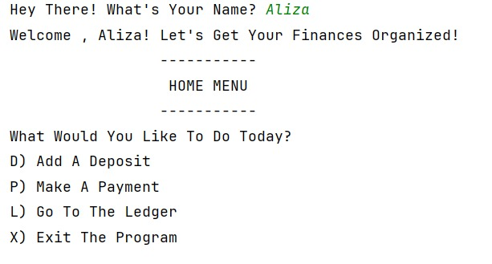
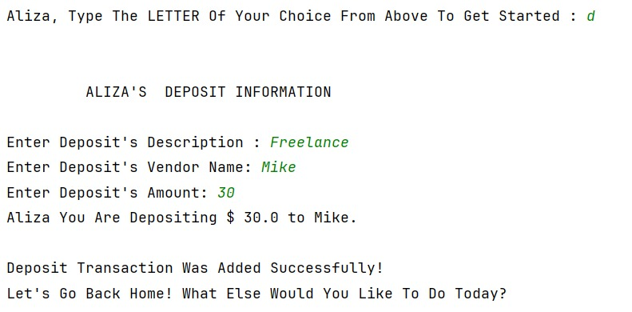
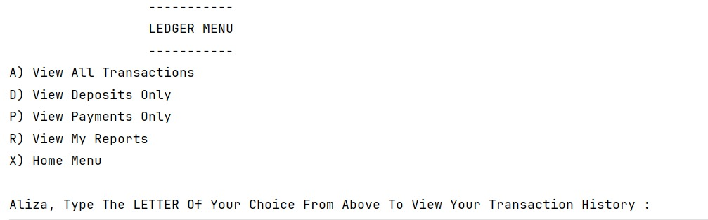
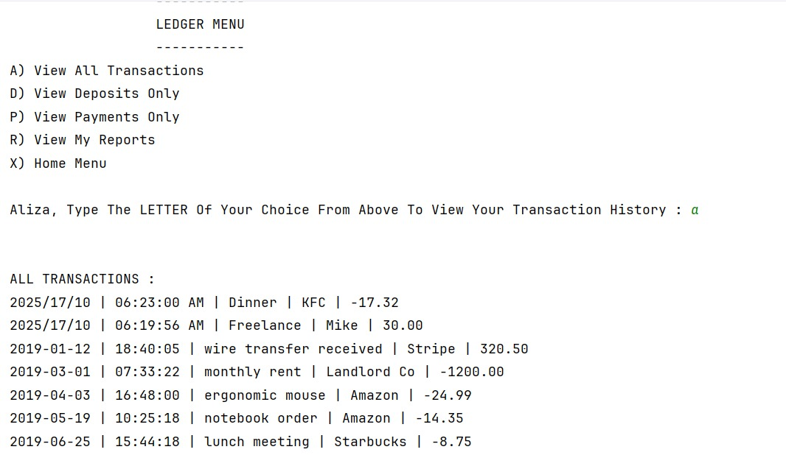
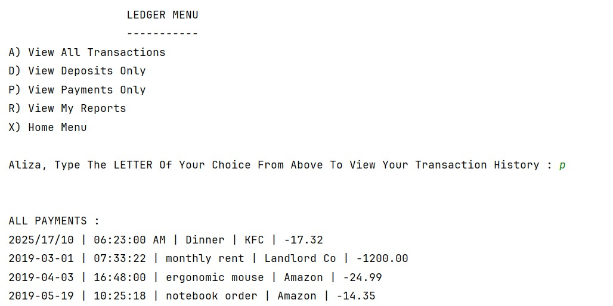
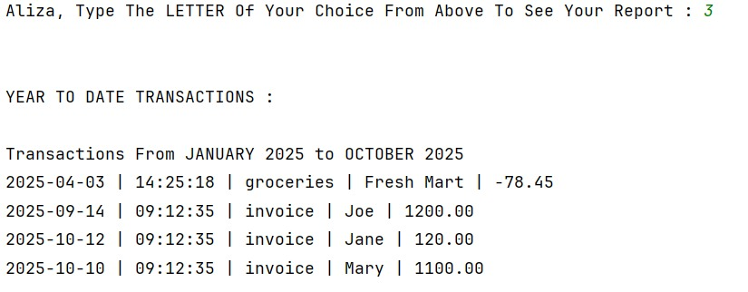
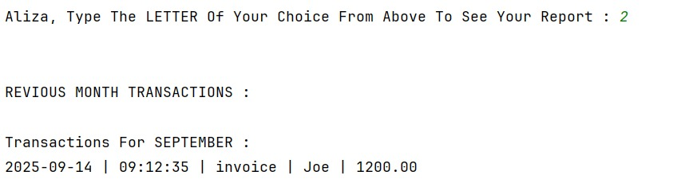
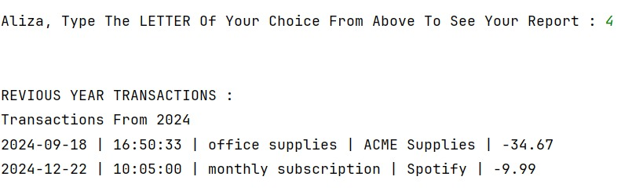
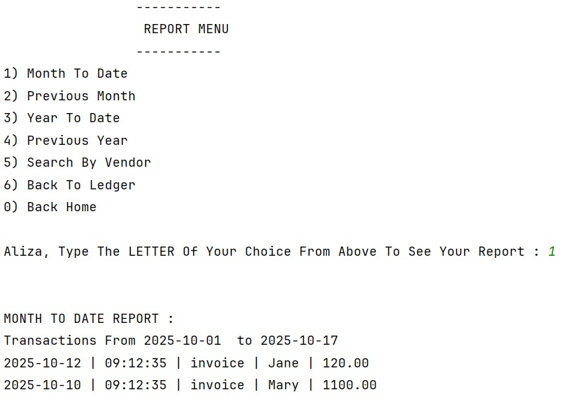
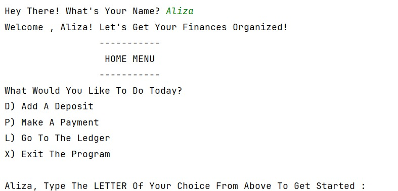

# Accounting Ledger CLI Application 

This is my Java command-line application for tracking financial transactions.

---

## 📋 Project Description

This application allows users to track deposits and payments and navigate between menus.
All transactions are stored in a CSV file and can be viewed with various filters and pre-defined reports.

---

## ✨ Features

### Home Screen
- **D) Add Deposit** - Record incoming transactions where date and time is automatically added 
- **P) Make Payment** - Record outgoing payments where date and time is automatically added
- **L) Ledger** - View transaction history, filtered by options like view all deposits, view all payments.
- **X) Exit** - Close the application, lets the user exit out of the program. 

### Ledger Screen
- **A) All** - Display all transactions (newest first)
- **D) Deposits** - Show deposits only
- **P) Payments** - Show payments only
- **R) Reports** - Access report menu

### Reports Menu
- **1) Month To Date** - Current month transactions to Date
- **2) Previous Month** - Last month's transactions
- **3) Year To Date** - Current year transactions to Date
- **4) Previous Year** - Last year's transactions
- **5) Search by Vendor** - Filter by vendor name

---

## 🚀 How to Run

1. Open the project in IntelliJ IDEA
2. Run the `Main.java` file
3. Follow the on-screen prompts to navigate menus
4. All Transactions are automatically saved to `transactions.csv`

---

## 💾 CSV Format

Transactions are stored in CSV format with pipe delimiters:
```
date|time|description|vendor|amount
2023-04-15|10:13:25|ergonomic keyboard|Amazon|-89.50
2023-04-15|11:15:00|Invoice 1001 paid|Joe|1500.00
```

**Note:** Deposits are positive values, payments are negative values.

---

## 📸 Screenshots

### Home Menu


### Adding a Deposit


## Ledger View  

### Ledger Options 


### Reports Menu Options 





---

## 📝 Interesting Part Of My Code

## Ask UserName Method
```java
// takes userName and saves it into userName variable
private void askUserName() {
    System.out.print("Hey There! What's Your Name?");
    // take user input and save it to the userName variable and converts to uppercase
    userName = myScanner.nextLine().trim();

    while (userName.isEmpty()) {
        // if left empty prompts the user to add input
        System.out.println("Oops, You Forgot To Type In Your Name! Let's Try That Again.");
        userName = myScanner.nextLine().trim();
    }

    System.out.println("Welcome , " + userName + "! Let's Get Your Finances Organized!");
}
```
This allows the user to have a more personalized experience when adding payments,deposits or just viewing reports. 
